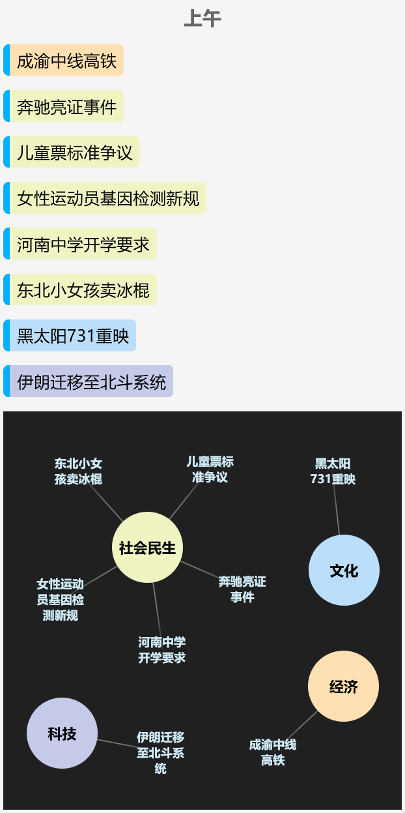
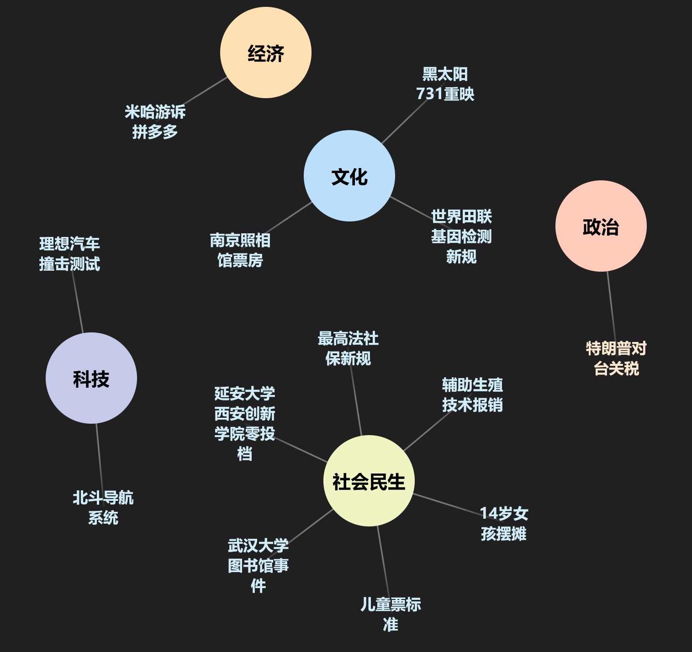

# *TimeLemon* - 社会事件爬取梳理与可视化


TimeLemon 是一个用 `Dart` 编写的工具，用于爬取多个平台的热搜榜单数据，筛选梳理社会实践，并将其转换为 `JSON` 格式，同时提供可视化功能。

## 功能特性

- 📊 多平台热搜数据采集
    - [X] Bing
    - [X] Bilibili
    - [X] 抖音
    - [X] 百度
    - [X] 微博
    - [X] 知乎
- [X] 🗃️ 结构化 `JSON` 数据输出
- [X] 🔍 数据去重与清洗
- [X] 📈 数据可视化功能

### 输出格式

程序会生成如下结构的 `JSON` 文件：

```json
[
    {
        "word": "杨景媛论文造假事件",
        "kind": "社会民生",
        "sign": "important",
        "desc": "武汉大学女学生论文涉嫌AI代写引发学术诚信讨论"
    },
    {
        "word": "堪察加8.8级地震",
        "kind": "公共安全",
        "sign": "urgent",
        "desc": "强震引发海啸预警，我国沿海地区面临灾害性影响"
    },
    {
        "word": "中美新一轮经贸会谈",
        "kind": "经济",
        "sign": "urgent",
        "desc": "双方推动关税展期，稳定双边经贸关系"
    }
]
```

## 可视化

> 开发中...

[Github Pages](https://willsat.github.io/timelemon/root/)

| 四分之一天可视化 | 网状图 |
|---|---|
|||

## 贡献

欢迎提交 [Issue](https://github.com/WillSat/timelemon/issues) 和 Pull Request！

## 许可证

MIT License